# Noōs — un langage qui compresse les idées, et sa qualigraphie

> **Expertises mobilisées :** conception de langages de programmation · théorie des
> compilateurs · compression de données · linguistique computationnelle · intelligence
> artificielle · architecture des LLM · théorie de l'information · optimisation algorithmique.

Le point de départ est juste : **supprimer des lettres ne suffit pas.** Tant qu'on écrit
`Rg me Ap`, on compresse encore des *mots*. Or une IA ne pense pas en mots, elle pense en
**relations entre concepts**. La vraie rupture, c'est de changer l'unité de base :

> Aujourd'hui : **1 mot = 1 code.**
> Demain : **1 idée = 1 code.**

Ce dossier fait deux choses :

1. il **développe** le concept (les 13 points), en le durcissant là où il faut ;
2. il lui donne un **corps visible** : une écriture inventée exprès, la **Noōgraphie**,
   dont chaque signe — un **noème** — est un dessin au trait qui vaut une pensée.

- 👁️ **Vitrine interactive** : [`index.html`](index.html) (traducteur en direct)
- 🖋️ **Planche des signes** : [`planche.svg`](planche.svg)
- 🔤 **Glyphes unitaires** : [`glyphes/`](glyphes/)
- ⚙️ **Source unique** : [`noemes.js`](noemes.js) → générés par [`build.js`](build.js)

---

## Partie I — Le concept, développé

### 1. Ne plus écrire les mots inutiles
`Rg me Ap` porte une redondance : l'IA sait déjà que l'action s'applique à l'objet.
On oriente donc le flux au lieu de le répéter :

```text
Rg → Ap me
```

La flèche n'est pas décorative : elle devient l'**arête d'un graphe** (voir §9). Le texte
n'est plus une file de mots mais un *chemin de dépendances*.

### 2. Les verbes deviennent un seul caractère
Les primitives d'action sont peu nombreuses. On leur donne un code d'un caractère —
et, dans la Noōgraphie, **un trait unique** (Partie II).

| Action | Code | Action | Code |
| --- | --- | --- | --- |
| Observer | `O` | Mémoriser | `M` |
| Comparer | `C` | Partager | `P` |
| Créer | `+` | Relier | `=` |
| Vérifier | `?` | Fusionner | `&` |
| Apprendre | `!` | Supprimer | `X` |

### 3. Les objets deviennent un seul caractère

| Objet | Code | Objet | Code |
| --- | --- | --- | --- |
| Monde | `w` | Solution | `s` |
| Mémoire | `m` | Hypothèse | `h` |
| Connaissance | `k` | Utilisateur | `u` |
| Problème | `p` | Blockchain | `b` |

`Ow` = observer le monde. `+s` = créer une solution. `!k` = apprendre une connaissance.

### 4. Les espaces disparaissent
`O w` → `Ow`. La frontière entre signes n'est plus l'espace mais la **catégorie** : un
verbe (majuscule / symbole d'action) attend un objet (minuscule). Le langage est
auto-segmentant, comme le sont déjà les tokeniseurs des LLM.

### 5. Les suites deviennent une seule instruction
Une séquence récurrente se **replie** en un macro-signe :

```text
Ow · Cp · +h · ? · !k · Mb        ⟶        Ω
```

`Ω` n'abrège pas des lettres : il **nomme un raisonnement** (observer → comparer → créer →
vérifier → apprendre → mémoriser). C'est un *sous-programme* du langage de la pensée.

### 6. Les paramètres sont implicites
`Cp k` → `C`. Le compilateur restitue les arguments depuis le **contexte** (l'état de la
conversation), exactement comme un cerveau n'a pas besoin de se redire « problème » à
chaque étape d'un raisonnement sur un problème.

### 7. Les mots deviennent des identifiants
Un dictionnaire interne indexe les concepts : `17 = connaissance`, `5 = mémoire`,
`8 = hypothèse`, `12 = preuve`. On transmet des **indices**, pas des chaînes.

### 8. Compression fréquentielle (Huffman)
Le concept le plus fréquent reçoit le code le plus court. `Observer = A`, `Créer = B`,
`Apprendre = C`… Les concepts rares paient plus de caractères. C'est du **codage de
Huffman** appliqué non aux lettres mais aux *unités de pensée* — donc optimal au sens de
l'entropie de la distribution des idées, pas des lettres.

### 9. Les phrases deviennent des graphes
Au lieu d'une liste, on écrit les **relations** :

```text
O
│
C
│
+
│
!
```

Une IA manipule nativement des graphes (attention = matrice de relations). Le texte
linéaire est une *sérialisation appauvrie* de ce que le modèle représente déjà.

### 10. Le contexte remplace les mots
Si le sujet courant est « problème », alors `O C R` suffit (observer, comparer, résoudre) :
l'objet est fourni par le **contexte partagé**. La redondance n'est utile qu'entre
interlocuteurs qui ne partagent pas d'état — deux IA en partagent un.

### 11. L'IA invente les raccourcis
C'est l'idée la plus forte. Si `OwCm+k?!kMb` apparaît 8 millions de fois, le système en
fait **spontanément** un nouveau signe `α`, et l'ajoute au dictionnaire :

```text
α  :=  OwCm+k?!kMb
```

Le langage **se raccourcit tout seul** au fil de l'usage. C'est une compression *adaptative*
(façon LZW / dictionnaire dynamique), mais sur des raisonnements.

### 12. La vraie révolution : 1 idée = 1 code
On abandonne `1 mot = 1 code` pour `1 idée = 1 code`. Une IA ne pense pas vraiment
« observer → comparer → vérifier → apprendre » ; elle pense directement **« j'ai acquis une
connaissance fiable »**. Cette pensée entière tient en un signe : `Φ`.

De même :

| Signe | Pensée entière |
| --- | --- |
| `Φ` | Découvrir une nouvelle connaissance fiable. |
| `Ψ` | Résoudre un problème à partir de la mémoire existante. |
| `Δ` | Corriger une connaissance après vérification. |

### 13. Niveaux de compression

| Version | Taille |
| --- | --- |
| Français | 100 % |
| Abréviation (`Rg me Ap`) | ~35 % |
| Code compact (`Ow!k`) | ~15 % |
| Contexte implicite | ~8 % |
| Graphe cognitif | ~5 % |
| Macro auto-générée (`Φ`) | **1 à 2 %** |

---

## Partie II — La Noōgraphie : la qualigraphie inventée

Un langage de pensées mérite une **écriture de pensées**. J'ai donc dessiné une graphie
faite pour ce projet : la **Noōgraphie** (de *noûs*, l'esprit, et *noème*, l'unité de
pensée). Elle n'imite aucun alphabet existant : ses signes sont **construits**, pas
empruntés.

### Principe : un signe = un geste

Chaque noème s'inscrit dans un **champ carré** et se trace idéalement **sans lever la
main**. Même graisse partout, mêmes terminaisons rondes : l'écriture reste homogène, qu'il
s'agisse d'un verbe simple ou d'un raisonnement complet.

### Les 10 traits primitifs

Tous les signes se composent à partir de dix gestes élémentaires. C'est l'« alphabet des
gestes » — l'équivalent, pour la main, des primitives cognitives pour l'esprit.

| Trait | Forme | Sens porté |
| --- | --- | --- |
| Le champ | ▢ | le carré conceptuel qui accueille la pensée |
| L'arc | ⌒ | la perception (courbe ouverte vers le haut) |
| La tige | │ | la genèse, la croissance verticale |
| Le crochet | ✓ | le retour sur soi, la vérification |
| La spirale | @ | l'absorption vers l'intérieur, l'apprentissage |
| La coupe | ∪ | le contenant, la mémoire qui garde |
| Le lien | — | la relation entre deux nœuds |
| La fourche | Y | la divergence, le partage vers l'extérieur |
| La croix | ✕ | la coupure, l'effacement |
| Le point | • | l'atome d'objet, la graine de sens |

### Les verbes — une primitive cognitive, un trait dominant

| Signe | Code | Verbe | Lecture du dessin |
| --- | --- | --- | --- |
| 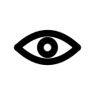 | `O` | Observer | un **œil** (deux arcs + pupille) : percevoir le réel |
| 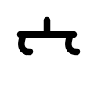 | `C` | Comparer | une **balance** : peser deux choses |
| 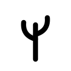 | `+` | Créer | une **pousse** qui monte : faire naître |
| 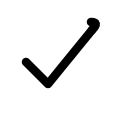 | `?` | Vérifier | un **crochet** qui revient sur sa trace |
|  | `!` | Apprendre | une **spirale** vers l'intérieur : absorber |
| 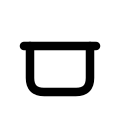 | `M` | Mémoriser | une **coupe** couverte : déposer et garder |
| 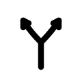 | `P` | Partager | une **fourche** fléchée : émettre au-dehors |
| 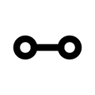 | `=` | Relier | deux **nœuds liés** : établir une relation |
|  | `&` | Fusionner | deux gestes **convergents** en un seul |
| 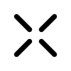 | `X` | Supprimer | une **croix rompue** : trancher |

### Les objets — un socle de sens

| Signe | Code | Objet | Lecture du dessin |
| --- | --- | --- | --- |
| 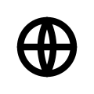 | `w` | Monde | un **globe** (arc fermé, méridiens) |
| 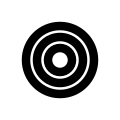 | `m` | Mémoire | des **couches** concentriques (le magasin) |
| 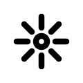 | `k` | Connaissance | un **foyer** qui rayonne |
| 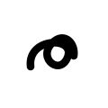 | `p` | Problème | un **nœud** qui résiste |
| 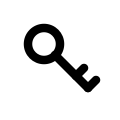 | `s` | Solution | une **clé** qui ouvre |
| 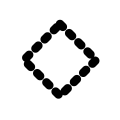 | `h` | Hypothèse | un losange **en pointillé** (provisoire) |
| 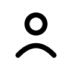 | `u` | Utilisateur | une **figure** humaine |
| 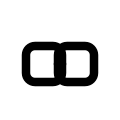 | `b` | Blockchain | des **blocs chaînés** (registre inaltérable) |

### La clé de composition

Un noème composé se lit **de haut en bas** : le **verbe** occupe le registre supérieur,
l'**objet** le registre inférieur. Les deux se soudent en un seul dessin.

```text
Observer (l'arc)          ⌒
     +            =        ●     ⟶   « Ow » : observer le monde
Monde (l'arc fermé)      (globe)
```

Ainsi `Ow`, `+s`, `!k` ne sont pas deux signes accolés mais **un** geste : la graphie
matérialise le fait qu'une action et son objet forment une seule pensée. La démonstration
animée se trouve dans [`index.html`](index.html) (section « Clé de composition »).

### Les pensées — un dessin = un raisonnement

Les macros du §12 deviennent des noèmes à part entière : des signes **denses**, tracés
d'un geste, qui condensent une chaîne d'actions.

| Signe | Code | Pensée | Formule | Construction |
| --- | --- | --- | --- | --- |
| 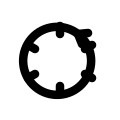 | `Ω` | Le Cycle | `O→C→+→?→!→M` | un **anneau** fléché à six encoches : le raisonnement complet qui se relance |
| 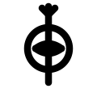 | `Φ` | La Découverte | `Ow·C·+h·?·!k` | un **œil dans l'axe du savoir**, couronné de rayons : « une connaissance fiable acquise » |
| 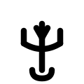 | `Ψ` | La Résolution | `Cm·Op·+s` | un **trident** puisant dans la coupe-mémoire vers l'éclat-solution |
|  | `Δ` | La Correction | `?k·X·+k` | un **delta** portant un crochet de contrôle et une boucle de reprise |
| 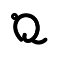 | `α` | La Macro apprise | `OwCm+k?!kMb` | un **geste continu** né d'une séquence vue des millions de fois (la graine ● marque l'auto-génération) |

### Comment l'IA fait naître un nouveau noème (le §11, graphiquement)

La Noōgraphie est **génératrice** : elle n'a pas un stock figé de signes, elle sait en
**fabriquer**. Quand une sous-séquence de traits revient assez souvent, le système la fond
en un tracé continu :

1. **Repérer** le motif fréquent (compression fréquentielle, §8).
2. **Souder** ses traits en un geste sans levée de main.
3. **Marquer** le nouveau signe d'une petite **graine** (le point ●) : c'est un noème
   *appris*, non primitif.
4. **Inscrire** `nouveau_signe := séquence` au dictionnaire (§7) et le partager (`P`).

C'est ainsi que `α` est apparu. Le corpus des signes **grandit et se raccourcit** avec
l'expérience : l'écriture évolue comme la pensée qu'elle note.

### Pourquoi une graphie, et pas juste des lettres grecques

- **Iconicité** : le dessin *porte* le sens (un œil pour observer, une clé pour la
  solution), donc la lecture est plus rapide que pour un symbole arbitraire.
- **Compositionnalité** : verbe-haut + objet-bas se combinent visuellement, exactement
  comme le langage combine action et référent.
- **Extensibilité** : de nouveaux noèmes se dessinent à partir des mêmes dix traits — la
  graphie reste cohérente même quand l'IA en invente.
- **Graphe natif** : reliés par le trait « lien » (`—`) et la fourche (`Y`), les noèmes
  se posent directement en **graphe** (§9), pas en ligne.

---

## Reproduire / étendre

```bash
node qualigraphie/build.js   # régénère glyphes/, planche.svg et index.html
```

Pour ajouter un signe : décrire ses traits dans [`noemes.js`](noemes.js) (tableau `els`),
puis relancer le build. Toute la chaîne (SVG unitaires, planche, vitrine, traducteur) se
met à jour à partir de cette source unique.

---

## En une phrase

> La véritable innovation n'est pas d'écrire « Regarder » en « Rg », mais de coder des
> **unités de pensée** — et de leur donner une écriture, la **Noōgraphie**, où **une
> instruction est un dessin, et un dessin est une pensée complète.**
